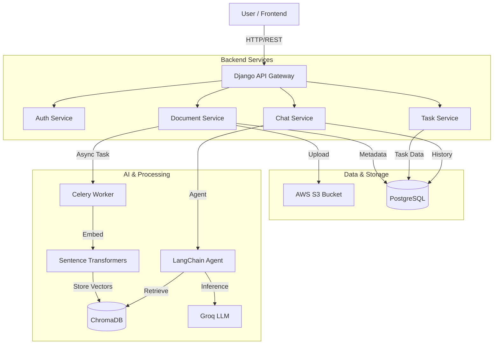

# 🤖 AI Workspace - Intelligent Document Assistant

A full-stack AI-powered workspace application that enables users to upload documents, process them with intelligent chunking, and interact with an AI assistant that can search through your knowledge base and manage tasks.


## 📋 Table of Contents

- [Features](#-features)
- [Architecture](#-architecture)
- [RAG Pipeline Explained](#-rag-pipeline-explained)
- [AI Agent & Tool Calling](#-ai-agent--tool-calling)
- [Tech Stack](#-tech-stack)
- [Project Structure](#-project-structure)
- [Prerequisites](#-prerequisites)
- [Getting Started](#-getting-started)
- [API Documentation](#-api-documentation)
- [Environment Variables](#-environment-variables)
- [Usage Guide](#-usage-guide)
- [Contributing](#-contributing)

## ✨ Features

### 🔐 Authentication System
- Custom JWT-based authentication (access + refresh tokens)
- User registration and login
- Workspace isolation (multi-tenant ready)

### 📄 Document Management (Knowledge Hub)
- **File Upload**: Support for PDF, DOCX, and TXT files (up to 50MB)
- **Cloud Storage**: Documents stored securely in AWS S3
- **Text Extraction**: Automatic extraction from various file formats
- **Intelligent Chunking**: Smart text splitting with semantic awareness
- **Vector Embeddings**: Documents embedded using sentence-transformers (all-MiniLM-L6-v2)
- **Vector Storage**: ChromaDB for efficient similarity search
- **Async Processing**: Celery-based background processing

### 🤖 AI Chat Assistant (RAG-Powered)
- **Groq LLM Integration**: Fast inference using Llama 3.1
- **RAG (Retrieval-Augmented Generation)**: AI searches your documents for relevant context
- **Tool-based Agent**: LangChain agent with multiple capabilities:
  - 🔍 Search documents by semantic similarity
  - ✅ Create tasks from conversations
  - 📋 List and manage tasks
  - 📁 List uploaded documents

### ✅ Task Management
- Create, update, and delete tasks
- Priority levels (Low, Medium, High)
- Status tracking (To Do, In Progress, Done)
- Due date management
- AI-created task flagging
- Link tasks to related documents

## 🏗 Architecture



## 🧠 RAG Pipeline Explained

The Retrieval-Augmented Generation (RAG) pipeline turns static documents into a queryable knowledge base.

1.  **Ingestion**:
    *   User uploads a file (PDF/DOCX/TXT).
    *   File is saved to **AWS S3**.
    *   A Celery background task is triggered.

2.  **Processing & Chunking**:
    *   Text is extracted using `pypdf` or `python-docx`.
    *   **Intelligent Chunking**: We use `RecursiveCharacterTextSplitter` to split text into 1000-character chunks with 200-character overlap. This preserves semantic context better than fixed-size splitting.

3.  **Embedding**:
    *   Each chunk is passed through the `all-MiniLM-L6-v2` model (via `sentence-transformers`).
    *   This converts text into a 384-dimensional vector representation.

4.  **Storage**:
    *   Vectors + Metadata (source document ID, page number) are stored in **ChromaDB**.

5.  **Retrieval & Generation**:
    *   When a user asks a question, the query is embedded into a vector.
    *   ChromaDB performs a semantic similarity search to find the top 4 most relevant chunks.
    *   These chunks are fed as "Context" to the **Groq LLM** (Llama 3) along with the user's question to generate an accurate answer.

## 🤖 AI Agent & Tool Calling

The system uses a **LangChain Agent** that acts as a reasoning engine. Instead of just answering text, it decides *which tool* to use based on the user's intent.

### Available Tools

| Tool Name | Description | Trigger Example |
|-----------|-------------|-----------------|
| `search_documents` | Searches the vector database for information. | "What does the policy say about remote work?" |
| `create_task` | Creates a new task in the database. | "Remind me to email John tomorrow." |
| `list_tasks` | Retrieves the user's active tasks. | "What do I have to do today?" |
| `list_documents` | Lists all uploaded files. | "What files have I uploaded?" |

### How It Works
1.  **Input**: User sends "Create a high priority task to review the contract."
2.  **Reasoning**: The LLM analyzes the prompt and recognizes the intent matches the `create_task` tool signature.
3.  **Action**: The Agent extracts parameters (`title="Review contract"`, `priority="high"`) and executes the Python function.
4.  **Response**: The function returns a success message, which the LLM formats back to the user: "I've created the task 'Review contract' with high priority."

## 🛠 Tech Stack

### Backend
| Technology | Purpose |
|------------|---------|
| Django 4.2 | Web framework |
| Django REST Framework | API development |
| PostgreSQL | Primary database |
| Redis | Celery message broker |
| Celery | Async task processing |
| ChromaDB | Vector database |
| LangChain | AI agent framework |
| Groq | LLM provider (Llama 3.1) |
| sentence-transformers | Text embeddings |
| AWS S3 | File storage |
| Docker | Containerization |

### Frontend
| Technology | Purpose |
|------------|---------|
| React 19 | UI framework |
| React Router 7 | Client-side routing |
| CSS3 | Styling |

## 📁 Project Structure

```
aloma/
├── README.md                 # This file
├── .gitignore               # Git ignore rules
│
├── almo/                    # React Frontend
│   ├── public/              # Static assets
│   ├── src/
│   │   ├── components/      # Reusable components
│   │   │   ├── ChatView.js  # Chat interface
│   │   │   ├── Header.js    # App header
│   │   │   └── Sidebar.js   # Navigation sidebar
│   │   ├── contexts/        # React contexts
│   │   │   └── AuthContext.js  # Authentication state
│   │   ├── pages/           # Page components
│   │   │   ├── DashboardLayout.js  # Main app layout
│   │   │   ├── ProfilePage.js      # User profile
│   │   │   ├── SignInPage.js       # Login page
│   │   │   └── SignUpPage.js       # Registration page
│   │   ├── App.js           # Root component
│   │   └── App.css          # Global styles
│   └── package.json         # Dependencies
│
└── backend/                 # Django Backend
    ├── config/              # Django settings
    │   ├── settings.py      # Main configuration
    │   ├── urls.py          # URL routing
    │   ├── celery.py        # Celery configuration
    │   └── wsgi.py          # WSGI entry point
    │
    ├── accounts/            # User authentication app
    │   ├── models.py        # User, Workspace models
    │   ├── views.py         # Auth endpoints
    │   ├── serializers.py   # DRF serializers
    │   └── urls.py          # Auth routes
    │
    ├── documents/           # Document management app
    │   ├── models.py        # Document model
    │   ├── views.py         # Upload/CRUD endpoints
    │   ├── tasks.py         # Celery processing tasks
    │   ├── utils.py         # Text extraction utilities
    │   └── chroma_handler.py  # ChromaDB operations
    │
    ├── chat/                # AI Chat app
    │   ├── models.py        # ChatMessage, Conversation models
    │   ├── views.py         # Chat endpoints
    │   ├── agent.py         # LangChain AI agent
    │   └── tools.py         # Agent tools (search, tasks)
    │
    ├── tasks/               # Task management app
    │   ├── models.py        # Task model
    │   ├── views.py         # Task CRUD endpoints
    │   └── serializers.py   # Task serializers
    │
    ├── docker-compose.yml   # Docker services config
    ├── Dockerfile           # Backend container
    ├── requirements.txt     # Python dependencies
    └── .env.example         # Environment template
```

## 📦 Prerequisites

- **Docker** and **Docker Compose** (recommended)
- OR for local development:
  - Python 3.11+
  - Node.js 18+
  - PostgreSQL 15+
  - Redis 7+

### External Services Required

1. **AWS Account** with S3 bucket for file storage
2. **Groq API Key** for AI chat (free tier available at [console.groq.com](https://console.groq.com))

## 🚀 Getting Started

### Option 1: Using Docker (Recommended)

1. **Clone the repository**
```bash
git clone https://github.com/karan10i/AI_file-upload.git
cd AI_file-upload
```

2. **Set up environment variables**
```bash
cd backend
cp .env.example .env
# Edit .env with your actual values (see Environment Variables section)
```

3. **Start all services**
```bash
docker-compose up --build
```

4. **Run database migrations** (in a new terminal)
```bash
docker-compose exec web python manage.py migrate
docker-compose exec web python manage.py setup_initial_data
```

5. **Start the frontend** (in a new terminal)
```bash
cd ../almo
npm install
npm start
```

6. **Access the application**
- Frontend: http://localhost:3000
- Backend API: http://localhost:8000
- API Docs: http://localhost:8000/swagger/

### Option 2: Local Development

#### Backend Setup

1. **Create virtual environment**
```bash
cd backend
python -m venv venv
source venv/bin/activate  # On Windows: venv\Scripts\activate
```

2. **Install dependencies**
```bash
pip install -r requirements.txt
```

3. **Set up environment**
```bash
cp .env.example .env
# Edit .env with your database and service credentials
```

4. **Start PostgreSQL and Redis** (locally or via Docker)
```bash
# Using Docker for just databases:
docker run -d --name postgres -p 5432:5432 -e POSTGRES_PASSWORD=postgres123 -e POSTGRES_DB=ai_workspace postgres:15
docker run -d --name redis -p 6379:6379 redis:7-alpine
docker run -d --name chroma -p 8001:8000 chromadb/chroma:latest
```

5. **Run migrations**
```bash
python manage.py migrate
python manage.py setup_initial_data
```

6. **Start Celery worker** (in separate terminal)
```bash
celery -A config worker -l info
```

7. **Start Django server**
```bash
python manage.py runserver
```

#### Frontend Setup

```bash
cd almo
npm install
npm start
```

## 📖 API Documentation

### Authentication Endpoints

| Method | Endpoint | Description |
|--------|----------|-------------|
| POST | `/api/auth/signup/` | Register new user |
| POST | `/api/auth/signin/` | Login and get tokens |
| POST | `/api/auth/token/refresh/` | Refresh access token |
| GET | `/api/auth/me/` | Get current user info |

### Document Endpoints

| Method | Endpoint | Description |
|--------|----------|-------------|
| GET | `/api/documents/` | List user's documents |
| POST | `/api/documents/` | Upload new document |
| GET | `/api/documents/{id}/` | Get document details |
| DELETE | `/api/documents/{id}/` | Delete document |
| POST | `/api/documents/{id}/reprocess/` | Reprocess failed document |

### Task Endpoints

| Method | Endpoint | Description |
|--------|----------|-------------|
| GET | `/api/tasks/` | List user's tasks |
| POST | `/api/tasks/` | Create new task |
| GET | `/api/tasks/{id}/` | Get task details |
| PUT | `/api/tasks/{id}/` | Update task |
| DELETE | `/api/tasks/{id}/` | Delete task |

### Chat Endpoints

| Method | Endpoint | Description |
|--------|----------|-------------|
| POST | `/api/chat/` | Send message to AI |
| GET | `/api/chat/conversations/` | List conversations |
| GET | `/api/chat/conversations/{id}/` | Get conversation history |

### Admin Endpoints (Requires Admin/Staff privileges)

| Method | Endpoint | Description |
|--------|----------|-------------|
| GET | `/api/auth/admin/users/` | List all users |
| PATCH | `/api/auth/admin/users/{id}/block/` | Block/Unblock a user |
| GET | `/api/auth/admin/ai-usage/` | Get AI usage statistics |

#### Admin Endpoints Details

**GET `/api/auth/admin/users/`**
Returns a list of all users with admin-level details.

```json
{
  "count": 5,
  "users": [
    {
      "id": "uuid",
      "email": "user@example.com",
      "username": "user1",
      "is_active": true,
      "is_staff": false,
      "date_joined": "2024-01-01T00:00:00Z"
    }
  ]
}
```

**PATCH `/api/auth/admin/users/{id}/block/`**
Block or unblock a user. Send `{"block": true}` to block or `{"block": false}` to unblock.

```json
{
  "message": "User user@example.com has been blocked",
  "user": { ... }
}
```

**GET `/api/auth/admin/ai-usage/`**
Returns AI usage statistics.

```json
{
  "chat_statistics": {
    "total_messages": 150,
    "user_messages": 75,
    "assistant_messages": 75,
    "unique_users": 10
  },
  "task_statistics": {
    "total_tasks": 25,
    "ai_created_tasks": 8,
    "user_created_tasks": 17
  },
  "summary": {
    "total_ai_interactions": 75,
    "total_ai_created_items": 8
  }
}
```

### Full API Documentation

The backend includes auto-generated Swagger/OpenAPI documentation.

- **Swagger UI**: `http://localhost:8000/swagger/`
- **ReDoc**: `http://localhost:8000/redoc/`

## ⚙️ Environment Variables

Create a `.env` file in the `backend/` directory:

```env
# Django Settings
DEBUG=1
SECRET_KEY=your-secret-key-here-change-in-production

# Database
DB_HOST=db                    # Use 'localhost' for local dev
DB_PORT=5432
DB_NAME=ai_workspace
DB_USER=postgres
DB_PASSWORD=your-db-password-here

# Redis
REDIS_URL=redis://redis:6379/0  # Use 'redis://localhost:6379/0' for local

# AWS S3 Configuration (Required)
AWS_ACCESS_KEY_ID=your-aws-access-key-id
AWS_SECRET_ACCESS_KEY=your-aws-secret-access-key
AWS_STORAGE_BUCKET_NAME=your-s3-bucket-name
AWS_S3_REGION_NAME=your-aws-region

# ChromaDB Configuration
CHROMADB_HOST=chroma          # Use 'localhost' for local dev
CHROMADB_PORT=8000

# Groq API Key (Required for AI Chat)
GROQ_API_KEY=your-groq-api-key-here
```

## 📱 Usage Guide

### 1. Sign Up / Sign In
- Navigate to http://localhost:3000
- Create a new account or sign in with existing credentials

### 2. Upload Documents
- Click the 📎 button in the chat input
- Select PDF, DOCX, or TXT files
- Wait for processing to complete (you'll see status updates)

### 3. Chat with AI
- Type questions about your documents
- Example queries:
  - "What documents do I have?"
  - "Search my documents for [topic]"
  - "Summarize the content about [subject]"
  - "Create a task to review [document]"
  - "List my tasks"

### 4. Manage Tasks
- AI can create tasks from your conversations
- Tasks can be linked to relevant documents
- Manage priorities and due dates

## Security Notes

- Never commit `.env` files to version control
- Rotate API keys periodically
- Use strong, unique passwords for database
- Enable HTTPS in production
- Review AWS S3 bucket permissions

## Contributing

1. Fork the repository
2. Create a feature branch (`git checkout -b feature/amazing-feature`)
3. Commit changes (`git commit -m 'Add amazing feature'`)
4. Push to branch (`git push origin feature/amazing-feature`)
5. Open a Pull Request

## 📄 License

This project is licensed under the MIT License.
---

**Built with ❤️ by [Karan Gupta](https://github.com/karan10i)**
